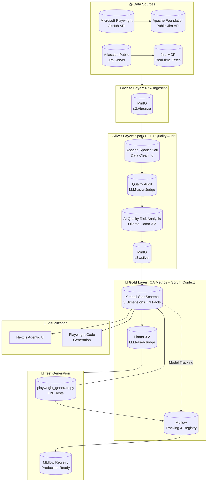
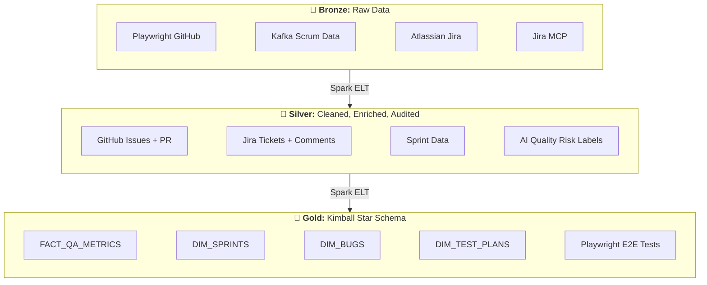
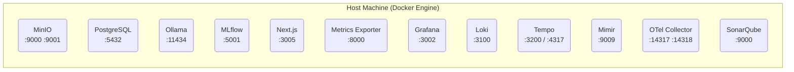
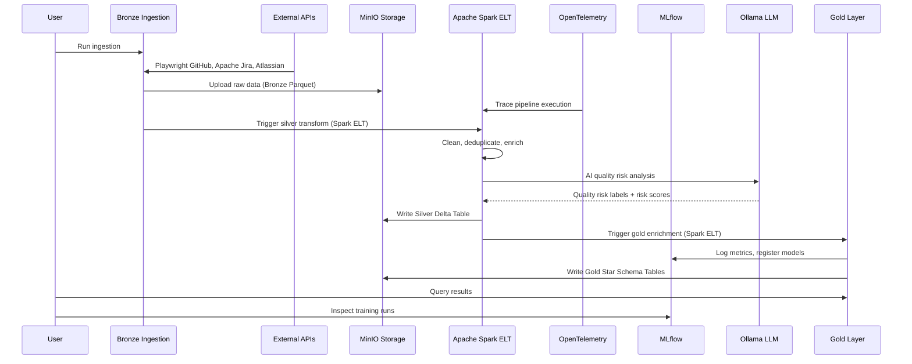
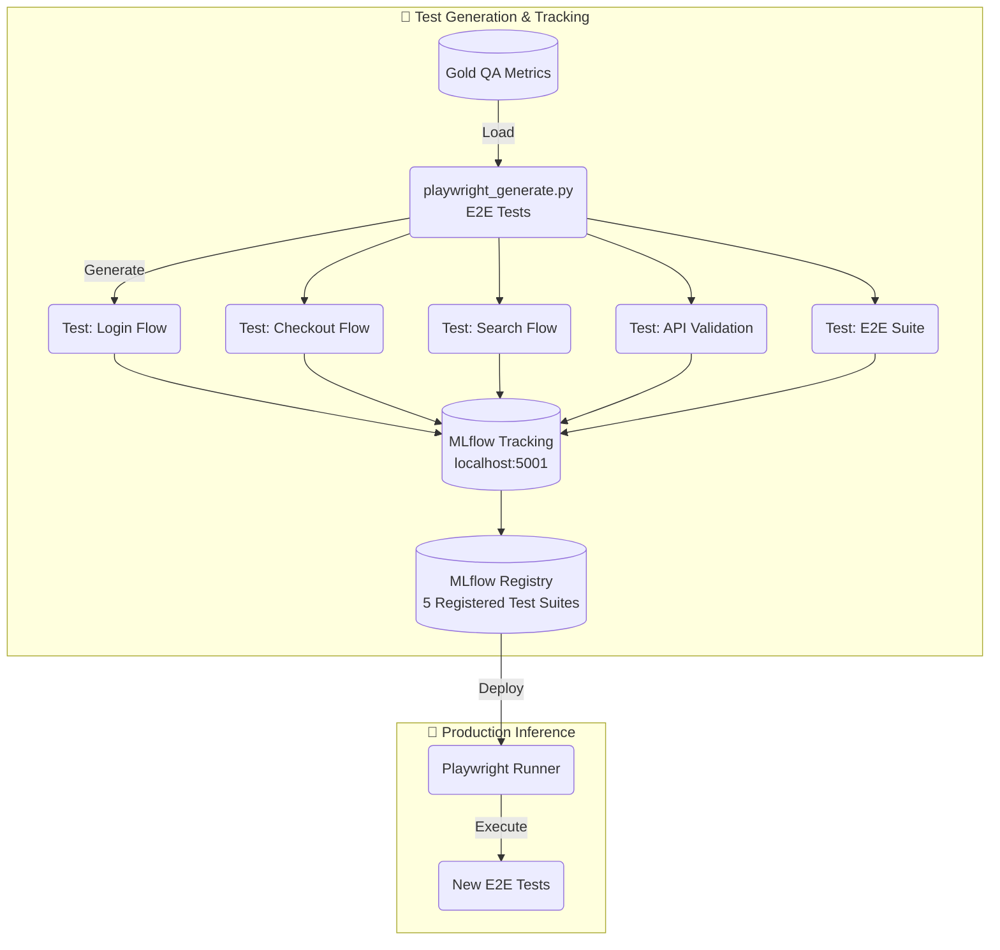
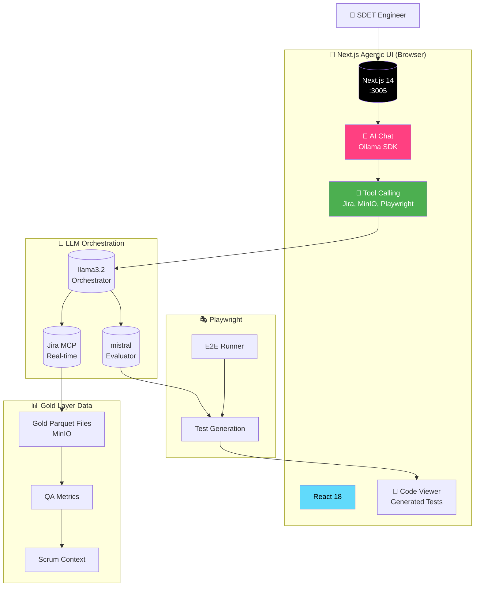
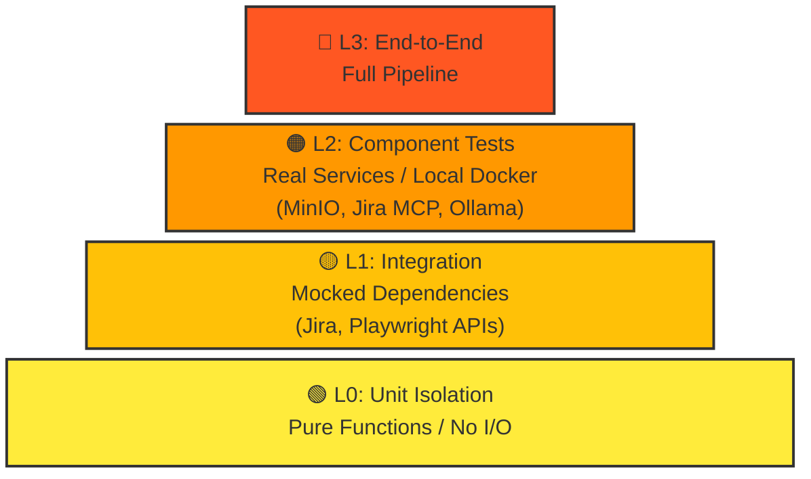

# SDET Command Center

An enterprise-grade **SDET Command Center** for QA and test automation using a Medallion Architecture pipeline (Bronze → Silver → Gold). This monorepo manages separate repositories for the frontend and backend services:

- **Frontend**: [BugMentor/sdet-agent-frontend](https://github.com/BugMentor/sdet-agent-frontend)
- **Backend**: [BugMentor/sdet-agent-backend](https://github.com/BugMentor/sdet-agent-backend)

## Table of Contents

1. [Architecture Overview](#architecture-overview)
2. [Infrastructure](#infrastructure)
3. [Data and Model Flow](#data-and-model-flow)
4. [Web App Architecture](#web-app-architecture)
5. [Tech Stack](#tech-stack)
6. [Getting Started](#getting-started)
7. [Pipeline Components](#pipeline-components)
8. [Telemetry (LGTM Stack)](#telemetry-lgtm-stack)
9. [Metrics & Monitoring](#metrics--monitoring)
10. [Testing Pyramid](#testing-pyramid)
11. [Development Rules](#development-rules)
12. [Deployment](#deployment)
13. [Troubleshooting](#troubleshooting)
14. [API References](#api-references)
15. [Credits](#credits)
16. [Contributing](#contributing)
17. [Funding & Support](#funding--support)

---

## Architecture Overview

### High-Level System Architecture



### Medallion Layers



---

## Infrastructure

### Docker Containers Architecture

The pipeline runs entirely in Docker containers orchestrated via `docker-compose.yml`:



### Service Details

| Service | Port | Image | Credentials | Purpose |
| --- | --- | --- | --- | --- |
| **Grafana** | 3002 | grafana/grafana | admin/admin123 | Dashboards & visualization |
| **Mimir** | 9009 | grafana/mimir | (no auth) | Metrics storage (Prometheus-compatible) |
| **Loki** | 3100 | grafana/loki | (no auth) | Log aggregation |
| **Tempo** | 3200 | grafana/tempo | (no auth) | Distributed tracing |
| **OTel Collector** | 14317 / 14318 | otel/opentelemetry-collector-contrib | (no auth) | Telemetry pipeline (gRPC + HTTP) |
| **MinIO Console** | 9001 | minio/minio | minioadmin/minioadmin | S3 object storage UI |
| **MinIO API** | 9000 | minio/minio | minioadmin/minioadmin | S3 API |
| **PostgreSQL** | 5432 | postgres:16-alpine | sdet/sdet123 | Jira data + MLflow backend |
| **Ollama** | 11434 | ollama/ollama | (no auth) | Local LLM inference |
| **MLflow** | 5001 | ghcr.io/mlflow/mlflow:v2.14.0 | (no auth) | Experiment tracking & model registry |
| **Metrics Exporter** | 8000 | custom | (no auth) | Prometheus metrics endpoint |
| **SonarQube** | 9000 | sonarqube:community | (no auth) | Static code analysis |
| **Spark Master (Sail)** | 50051 | bitnami/spark:3.5 | (no auth) | Distributed compute (Spark Connect) |

### Quick Start

```bash
# ONE COMMAND - everything up and ready to work
yarn up

# Or step by step:
# Start all infrastructure
docker compose -f backend/docker-compose.yml up -d

# Verify services
docker compose -f backend/docker-compose.yml ps

# Run the medallion pipeline
yarn pipeline

# Run test suite
yarn test:all

```

### Individual Service Access

```bash
# Grafana Dashboards (admin / admin123)
http://localhost:3002/d/sdet-data-quality/sdet-data-quality
http://localhost:3002/d/sdet-pipeline/sdet-pipeline-performance
http://localhost:3002/d/sdet-ml-models/sdet-ml-models

# SonarQube (admin / admin)
http://localhost:9000

# Metrics Exporter
http://localhost:8000/metrics

# MinIO Console (minioadmin / minioadmin)
http://localhost:9001

# MLflow (no auth)
http://localhost:5001

# Mimir (Prometheus-compatible API)
http://localhost:9009/prometheus

# Next.js Agentic UI
http://localhost:3000

```

### Environment Variables

```bash
# MinIO
S3_ENDPOINT=http://localhost:9000
S3_ACCESS_KEY=minioadmin
S3_SECRET_KEY=minioadmin
BRONZE_BUCKET=s3://bronze
SILVER_BUCKET=s3://silver
GOLD_BUCKET=s3://gold

# PostgreSQL
POSTGRES_USER=sdet
POSTGRES_PASSWORD=sdet123
POSTGRES_DB=sdet_medallion

# MLflow
MLFLOW_TRACKING_URI=http://localhost:5001

# Ollama
OLLAMA_HOST=http://localhost:11434
OLLAMA_MODEL=llama3.2:3b

# Spark / Sail
SPARK_MASTER=spark://localhost:7077
SAIL_HOST=localhost
SAIL_PORT=50051

# OpenTelemetry / LGTM
OTEL_COLLECTOR_HOST=localhost
OTEL_GRPC_PORT=4317
OTEL_HTTP_PORT=4318
OTEL_SERVICE_NAME=sdet-pipeline
ENVIRONMENT=development

# Pipeline skip flags
SKIP_BRONZE=false
SKIP_SILVER=false
SKIP_AI=false
SKIP_AUDIT=false
SKIP_GOLD=false

# Quality audit thresholds
MIN_ROW_THRESHOLD=100
MAX_NULL_RATIO=0.30
MAX_DUPLICATE_RATIO=0.05

# Metrics
METRICS_PORT=8000
RUN_METRICS=true

# Jira
JIRA_EMAIL=your@email.com
JIRA_API_TOKEN=your-api-token

```

### Stopping and Cleanup

```bash
# Stop services
docker compose -f backend/docker-compose.yml down

# Stop and remove volumes
docker compose -f backend/docker-compose.yml down -v

# Remove all containers, volumes, and images
docker compose -f backend/docker-compose.yml down --rmi all -v

```

### Troubleshooting

```bash
# Check container status
docker compose -f backend/docker-compose.yml ps -a

# Restart a specific service
docker compose -f backend/docker-compose.yml restart minio

# View service logs
docker compose -f backend/docker-compose.yml logs --tail=100 minio

# Shell into a container
docker compose -f backend/docker-compose.yml exec minio sh

```

### Data Persistence

Data persists in Docker volumes:

* `postgres_data` - PostgreSQL database
* `minio_data` - MinIO storage
* `mimir_data` - Mimir metrics storage
* `tempo_data` - Tempo trace storage
* `loki_data` - Loki log storage
* `ollama_data` - Ollama models
* `sonarqube_data`, `sonarqube_logs`, `sonarqube_extensions` - SonarQube data

---

## Data and Model Flow

### Pipeline Execution Flow



### Playwright Test Generation Flow



---

## Web App Architecture

### Agentic UI + Ollama SDK



### Features

* **Split-Pane Agentic UI**: Chat (left), Medallion Data (top-right), Code Viewer (bottom-right)
* **Ollama Tool Calling**: Integrate Jira MCP, MinIO, and Playwright tools
* **5 Playwright E2E Test Suites**: Login, Checkout, Search, API Validation, Full E2E
* **Real-time filtering**: Filter by priority, sprint, test status
* **Jira MCP Integration**: Fetch real-time Jira tickets and sprint data
* **Next.js 14 App Router**: Modern React full-stack with SSR
* **React 18**: Concurrent mode, automatic batching
* **Hot Module Reloading**: Development with live reload

### Tech Stack Details

```
Frontend Stack:
├── Next.js 14 (App Router with SSR)
├── React 18 (Hooks + Concurrent Mode)
├── Ollama SDK (Tool Calling)
├── TypeScript 5.0
├── Tailwind CSS
└── Jira MCP Integration

Backend Stack:
├── Python 3.11+ (Core pipeline)
├── Apache Spark / Sail (Distributed compute)
├── MinIO (S3-compatible storage)
├── PostgreSQL 16
├── MLflow (Experiment tracking + Model registry)
├── Ollama (Llama 3.2)
├── OpenTelemetry (LGTM telemetry)
└── Jira REST API + MCP

```

### Running the Web App

```bash
# Development
yarn dev

# Production build
yarn build
yarn start

```

---

## Tech Stack

| Component | Technology | Version | Purpose |
| --- | --- | --- | --- |
| **Pipelines** | Python | 3.11+ | Medallion architecture orchestration |
| **Compute** | Apache Spark / Sail | 3.5 / 0.6 | Distributed ELT processing |
| **Storage** | MinIO | Latest | S3-compatible object storage |
| **Database** | PostgreSQL | 16 | MLflow backend + metadata |
| **MLOps** | MLflow | 2.14.0 | Experiment tracking, model registry |
| **LLM** | Ollama + Llama 3.2 | Latest | AI enrichment + quality risk analysis |
| **LLM Judge** | Llama 3.2 | Latest | LLM-as-a-Judge quality evaluation |
| **Frontend** | Next.js 14 | 14 | Agentic UI with SSR |
| **AI SDK** | Ollama SDK | Latest | Tool calling & chat |
| **E2E Testing** | Playwright | Latest | Browser automation |
| **Telemetry** | OpenTelemetry | Latest | Traces, metrics, logs collection |
| **Metrics** | Mimir (Prometheus) | Latest | Scalable metrics storage |
| **Traces** | Tempo | Latest | Distributed tracing |
| **Logs** | Loki | Latest | Log aggregation |
| **Dashboards** | Grafana | Latest | Visualization (LGTM) |
| **Static Analysis** | SonarQube | 10.4 | Code quality scanning |

---

## Getting Started

### Prerequisites

```bash
# Core requirements
Python >= 3.11
Node.js >= 18
Docker >= 20.10
Docker Compose >= 2.0
Yarn >= 1.22
16GB RAM recommended

```

### Quick Start

```bash
# 1. Clone with submodules
git clone --recurse-submodules https://github.com/BugMentor/sdet-agent
cd sdet-agent

# 2. Everything up and ready to work (installs deps, starts Docker services,
#    pulls Ollama model, creates MinIO buckets, starts frontend)
yarn up

# 3. Run full pipeline
yarn pipeline

# 4. Run test suite
yarn test:all

# 5. Stop everything
yarn infra:down

```

---

## Pipeline Components

### 1. Bronze Layer (Raw Data Ingestion)

**File:** `backend/src/bronze_ingestion.py`

Ingests raw data from external sources into MinIO Bronze layer:

| Source | API | Format |
| --- | --- | --- |
| Microsoft Playwright | GitHub API | JSON → Parquet |
| Kafka Scrum Data | Apache Public Jira API | JSON → Parquet |
| Atlassian Jira | Public Jira Server | JSON → Parquet |
| Jira MCP | Real-time Fetch | JSON → Parquet |

Generates sample data: 50 Jira tickets, 30 QA metric records, 15 scrum records.

**Execution:**

```bash
# Via Python directly
python -m src.bronze_ingestion

# Via yarn
yarn workspace sdet-backend pipeline

```

### 2. Silver Layer (Cleaned + Enriched + Quality Audit)

Two transformation paths are available:

#### Spark-based enrichment (`backend/src/silver_enrichment.py`)

Reads Bronze JSONs, cleans, deduplicates, and writes ACID-compliant Delta Tables:

- **Jira enrichment**: `ticket_age_hours`, `priority_score`, `is_stale`, `sla_breach`
- **QA enrichment**: `test_pass_ratio`, `stability_score`, `quality_tier` (Poor/Fair/Good/Excellent)
- **Scrum enrichment**: `sprint_length_days`, `velocity_per_day`, `completion_rate`, `sprint_health` (Off Track/At Risk/On Track)

#### Pandas-based transform (`backend/src/silver_pandas_transform.py`)

Lightweight alternative for smaller datasets — same enrichment logic without Spark.

#### AI Quality Risk Analysis (`backend/src/silver_ai_enrichment.py`)

Uses **Ollama + Llama 3.2** to detect quality risks in test artifacts:

| Risk Category | Description |
| --- | --- |
| `race_condition` | Concurrent access issues |
| `null_pointer` | Missing null checks |
| `memory_leak` | Resource not released |
| `deadlock` | Lock contention |
| `sql_injection` | Unsafe query construction |
| `xss` | Cross-site scripting vulnerability |
| `authentication_bypass` | Auth logic flaws |
| `data_exposure` | Sensitive data leakage |
| `performance_bottleneck` | Slow operations |
| `test_flakiness` | Non-deterministic tests |
| `deployment_risk` | Release risks |

Analysis returns structured JSON with risk list, scores, and summary — logged to MLflow.

#### LLM-as-a-Judge Quality Audit (`backend/src/silver_quality_audit.py`)

Uses **"LLM-as-a-Judge"** pattern for robust quality assurance:

- **Extraction Model**: `llama3.2:3b` — Extracts structured data
- **Judge Model**: `llama3.2:3b` — Evaluates extraction quality on 5 weighted criteria

| Criterion | Weight | Threshold | Description |
| --- | --- | --- | --- |
| `correctness` | 0.30 | 0.70 | Quality risk identification correctness |
| `completeness` | 0.25 | 0.60 | Coverage of all relevant quality risks |
| `precision` | 0.20 | 0.65 | Minimize false positives |
| `actionability` | 0.15 | 0.50 | Recommendations are actionable |
| `latency` | 0.10 | 0.80 | Response time is acceptable |

Evaluation flow:

1. Llama 3.2 extracts structured JSON from Silver data
2. Judge scores the quality risk analysis (1-5 scale) with rationale
3. Failed analyses are quarantined
4. Accuracy metrics logged to MLflow

**Configuration constants:**

| Variable | Default | Description |
| --- | --- | --- |
| `MIN_ROW_THRESHOLD` | 100 | Minimum rows before audit passes |
| `MAX_NULL_RATIO` | 0.30 | Max allowed null ratio |
| `MAX_DUPLICATE_RATIO` | 0.05 | Max allowed duplicate ratio |
| `AUDIT_TABLES` | enriched_jira_tickets, enriched_qa_metrics, enriched_scrum_events | Tables to audit |

**Scripts:**

* `backend/test_judge.py` - Standalone judge test with sample evaluations
* `backend/src/judge_config.py` - Judge configuration and evaluation engine

### 3. Gold Layer (Kimball Star Schema)

**File:** `backend/src/gold_dimensional_modeling.py`

Creates a Kimball star schema for SDET analytics with 5 dimensions and 3 fact tables:

#### Dimensions

| Table | Key Fields |
| --- | --- |
| `dim_date` | date_key, year, month, day, quarter, day_of_week, day_name, month_name |
| `dim_ticket` | ticket_key, title, issue_type, status, priority, priority_score, project, assignee, reporter, resolution |
| `dim_team` | team_key, board_name, organization |
| `dim_project` | project_key, project_name, category, lead |
| `dim_sprint` | sprint_key, sprint_name, sprint_goal, start_date, end_date, sprint_length_days, sprint_health |

#### Facts

| Table | Key Fields |
| --- | --- |
| `fact_tickets` | ticket_key, date_key, project_key, age_hours, is_stale, sla_breach, priority_score, story_points, time_spent_hours |
| `fact_qa` | suite_key, run_id, total_tests, passed_tests, failed_tests, test_pass_ratio, stability_score, quality_tier |
| `fact_scrum` | sprint_key, team_key, committed_story_points, completed_story_points, velocity_per_day, completion_rate, sprint_health, sprint_length_days |

**Output:** `s3://gold/` (Parquet format)

### 4. Dual Compute Modes

| Mode | Engine | When to Use |
| --- | --- | --- |
| **Spark** | Sail (Rust-native Spark Connect) + PySpark | Large datasets (100K+ rows), distributed processing |
| **Pandas** | pandas + numpy | Small datasets, local development, no Spark dependency |

The Sail Spark Connect server runs on port `50051`:

```bash
yarn sail:start
```

### 5. MLflow Integration

#### Tracking

Every pipeline run is tracked in MLflow with:
- Layer-level metrics (record counts per dataset)
- Quality audit scores
- AI quality risk parameters
- Model evaluation results

#### Model Registry

Registered models:

| Model | Description |
| --- | --- |
| `quality-risk-analyzer` | AI quality risk analysis model |
| `quality-auditor` | Quality score predictor |
| `scrum-analyzer` | Sprint velocity forecaster |

#### Prompts

MLflow prompts for LLM-based operations:

| Prompt | Purpose |
| --- | --- |
| `quality_risk_extraction_v1` | Analyze quality risks in test artifacts |
| `quality_audit_v1` | Evaluate extraction quality |

**Setup scripts:**

```bash
# Register all models
python backend/register_models.py

# Register judge model
python backend/register_judge.py

# Create prompts
python backend/create_prompts.py
python backend/setup_mlflow_prompts.py

# Run MLflow evaluation from dataset
python backend/evaluate_from_dataset.py --dataset <path>

```

### 6. Full Pipeline Orchestration

**Command:** `yarn pipeline`

Runs complete Bronze → Silver Enrichment → AI Enrichment → Quality Audit → Gold pipeline:

```bash
yarn pipeline

# Individual layer skip flags:
SKIP_BRONZE=true SKIP_SILVER=false yarn pipeline

```

---

## Telemetry (LGTM Stack)

The SDET Agent uses the **LGTM stack** as its official telemetry backbone:

| Component | Role | Port | Container |
|-----------|------|------|-----------|
| **L**oki | Log aggregation | 3100 | `sdet-agent-loki` |
| **G**rafana | Visualization & dashboards | 3002 | `sdet-agent-grafana` |
| **T**empo | Distributed tracing (OTLP-native) | 3200 / 4317 | `sdet-agent-tempo` |
| **M**imir | Metrics (Prometheus-compatible) | 9009 | `sdet-agent-mimir` |
| OTEL Collector | Telemetry pipeline (ingest → route) | 14317 / 14318 | `sdet-agent-otel-collector` |

### Data Flow

```
SDET Pipeline → OTEL SDK → OTEL Collector → Tempo (traces)
                                            → Mimir (metrics)
                                            → Loki (logs)
                                            → Grafana (unified dashboards)
```

### OTEL Collector Configuration

Located at `backend/otel-collector/otel-collector-config.yaml`:

- **Receivers**: OTLP gRPC (4317), OTLP HTTP (4318)
- **Processors**: batch, memory_limiter, attributes, resource
- **Exporters**: otlp/tempo (traces), prometheusremotewrite/mimir (metrics), otlphttp/loki (logs), debug

### Telemetry SDK (`backend/src/telemetry.py`)

Custom Python instrumentation:

| Instrument | Type | Description |
| --- | --- | --- |
| `sdet_pipeline_runs_total` | Counter | Pipeline execution count by status |
| `sdet_records_processed_total` | Counter | Total records processed by layer |
| `sdet_pipeline_errors_total` | Counter | Error count by component |
| `sdet_pipeline_duration_seconds` | Histogram | Pipeline duration distribution |
| `sdet_layer_record_count` | Gauge | Current record count per layer |

### Standalone Monitoring Stack

A lightweight stack is available at `backend/docker-compose.monitoring.yml` for running only the monitoring infrastructure:

```bash
docker compose -f backend/docker-compose.monitoring.yml up -d
```

### Grafana Dashboards

3 pre-provisioned dashboards:

| Dashboard | Datasource | Metrics |
| --- | --- | --- |
| **Data Quality** | Mimir | Null ratios, duplicate ratios, quality scores |
| **ML Models** | Mimir | Model performance, evaluation metrics, latency |
| **Pipeline Performance** | Mimir | Layer durations, record counts, throughput |
| **Trace Explorer** | Tempo | Distributed trace visualization |
| **Log Explorer** | Loki | Centralized log search |

---

## Metrics & Monitoring

### Metrics Exporter (`backend/src/metrics_exporter.py`)

Prometheus metrics server on port `8000`:

| Metric | Type | Labels |
| --- | --- | --- |
| `sdet_bronze_record_count` | Gauge | dataset |
| `sdet_silver_record_count` | Gauge | dataset |
| `sdet_gold_record_count` | Gauge | dataset |
| `sdet_data_quality_score` | Gauge | table |
| `sdet_ollama_available` | Gauge | — |
| `sdet_minio_available` | Gauge | — |
| `sdet_postgres_available` | Gauge | — |
| `sdet_process_memory_bytes` | Gauge | — |
| `sdet_process_cpu_percent` | Gauge | — |
| `sdet_pipeline_runs_total` | Counter | status |
| `sdet_records_processed_total` | Counter | layer |
| `sdet_pipeline_errors_total` | Counter | component |
| `sdet_ai_enrichments_total` | Counter | model |
| `sdet_pipeline_duration_seconds` | Histogram | — |

### Alert Rules

11 pre-configured alert rules at `backend/prometheus/rules/alerts.yml`:

| Alert | Severity | Condition |
| --- | --- | --- |
| `PipelineDown` | critical | Pipeline run failed |
| `HighErrorRate_API` | warning | API error rate > 0.1/s over 5m |
| `HighErrorRate_Ingestion` | warning | Ingestion error rate > 0.05/s |
| `NoDataProcessing` | critical | No records processed in 10m |
| `HighLatency_Bronze/Silver/Gold` | warning | Layer duration > 300s |
| `OTELCollectorDown` | critical | OTEL collector unreachable |
| `DataQualityBelowThreshold` | warning | Quality score < 0.8 |
| `SailServerDown` | critical | Spark Connect server unreachable |
| `HighMemoryUsage` | warning | Memory > 1GB |

### Diagnostic System (`backend/monitoring/diagnostic_checks.py`)

Validates the complete environment:

```bash
# Run diagnostics
python backend/monitoring/diagnostic_checks.py

# JSON output (for programmatic use)
python backend/monitoring/diagnostic_checks.py --json
```

Checks performed:
- 10 Python package dependencies
- 9 infrastructure services (MinIO, PostgreSQL, Ollama, MLflow, Mimir, Tempo, Loki, Grafana, OTEL Collector)
- Sail Spark Connect TCP connectivity
- HTTP endpoint availability

---

## Testing Pyramid



### Test Layers

| Layer | File | Scope | Dependencies |
| --- | --- | --- | --- |
| **L0** | `tests/test_l0_unit.py` | Pure functions, config, data transforms | None |
| **L1** | `tests/test_l1_integration.py` | Bronze→Silver flow, MLflow judge | Mocked APIs |
| **L2** | `tests/test_l2_component.py` | MinIO, MLflow, Mimir, Grafana | Docker containers |
| **L3** | `tests/test_l3_e2e.py` | Full pipeline, monitoring, telemetry | All services |

### Test Coverage

| Class/Group | Tests | Layer |
| --- | --- | --- |
| `TestConfig` | Config defaults, env vars | L0 |
| `TestDataTransformations` | Priority mapping, pass ratio | L0 |
| `TestMLModelUtilities` | Quality risk categories, judge criteria | L0 |
| `TestUtilityFunctions` | Env parsing, JSON, timestamps | L0 |
| `TestPrometheusMetrics` | Registry, metrics | L0 |
| `TestSilverEnrichment` | Dedup, stale detection, tiers | L0 |
| `TestTelemetry` | OTEL setup, tracers | L0 |
| `TestAviation` | Edge cases, empty data | L0 |
| `TestBronzeToSilver` | Sample generation, pandas transforms | L1 |
| `TestSilverTransformation` | Config defaults, stub mode | L1 |
| `TestMLflowIntegration` | Judge criteria, mocked output | L1 |
| `TestGoldDimensional` | Config defaults, stub mode | L1 |
| `TestMinIOConnection` | Bucket operations | L2 |
| `TestMLflowConnection` | Tracking URI, client creation | L2 |
| `TestPrometheusMetrics` | Mimir endpoints | L2 |
| `TestDockerHealthChecks` | Service health | L2 |
| `TestPipelineE2E` | Pipeline orchestration, error handling | L3 |
| `TestMonitoringE2E` | Metrics exporter, quality audit | L3 |
| `TestTelemetryE2E` | OTEL lifecycle, decorators | L3 |

### Frontend E2E Tests

Playwright tests in `frontend/e2e/`:

| File | Tests | Scope |
| --- | --- | --- |
| `command-center.spec.ts` | 7 scenarios | Main UI, chat, navigation, commands |
| `lightweight_chaos.spec.ts` | 2 scenarios | CI smoke check |
| `chaos_test_healing.spec.ts` | 3 scenarios | Resilience, 404 handling |

### Running Tests

```bash
# Run full test suite (backend + frontend)
yarn test:all

# Backend Python tests only
yarn workspace sdet-backend test:python

# Run specific layer
pytest tests/test_l0_unit.py -v
pytest tests/test_l1_integration.py -v -m L1
pytest tests/test_l2_component.py -v -m L2
pytest tests/test_l3_e2e.py -v -m L3

# Standalone E2E runner
python tests/e2e_test.py

# Frontend E2E tests
yarn workspace sdet-command-center test:e2e

```

---

## Development Rules

This repository enforces strict development rules via `AGENTS.md` and `GEMINI.md`:

- **NO NEW FILES**: All code changes must be made to existing files only
- **Test placement**: New tests go exclusively into `tests/test_l0_unit.py`, `tests/test_l1_integration.py`, `tests/test_l2_component.py`, `tests/test_l3_e2e.py`
- **Zero tolerance**: ALL tests must pass — no skips, no failures. `pytest.skip()` is forbidden.
- **Debugging screenshots**: Must be saved to `debugging/screenshots/` and NEVER committed
- **Telemetry stack**: LGTM only — no Prometheus, Jaeger, or other stacks permitted

---

## Deployment

### Docker Production Build

```bash
# Build all images
docker compose -f backend/docker-compose.yml build

# Scale services
docker compose -f backend/docker-compose.yml up -d

# Enable MLflow registry
docker compose -f backend/docker-compose.yml up -d mlflow-server

```

### God Mode Deploy

```bash
# Automated deployment
yarn god:deploy

```

### K8s (Future)

```bash
# Deploy to Kubernetes
kubectl apply -f k8s/

```

---

## Troubleshooting

| Issue | Solution |
| --- | --- |
| MinIO not connecting | Check `S3_ENDPOINT` and credentials in `.env` |
| Ollama API timeout | Increase `OLLAMA_HOST` timeout or check model availability |
| Jira MCP not responding | Verify `JIRA_API_TOKEN` and email |
| Missing telemetry data | Ensure OTEL Collector is running (`docker compose ps`) |
| MLflow not tracking | Check `MLFLOW_TRACKING_URI` and PostgreSQL connection |
| Jira API 406 error | Add `User-Agent: curl/8.7.1` header |
| LLM-as-a-Judge fails | Verify Ollama has the model pulled: `ollama pull llama3.2:3b` |
| Spark Connect fails | Start Sail server: `yarn sail:start` or check `SAIL_HOST`/`SAIL_PORT` |
| Port conflict on 9000 | SonarQube and MinIO both use 9000 — change one |
| Pipeline skip flags not working | Set env vars before running: `SKIP_BRONZE=true yarn pipeline` |

### Service Health Checks

```bash
# Run full diagnostic suite
python backend/monitoring/diagnostic_checks.py

# Individual checks
curl -s http://localhost:9000/minio/health/live       # MinIO
curl -s http://localhost:5001/health                   # MLflow
curl -s http://localhost:11434/api/tags                # Ollama
curl -s http://localhost:3002/api/health               # Grafana
curl -s http://localhost:9009/ready                    # Mimir
curl -s http://localhost:3200/ready                    # Tempo
curl -s http://localhost:3100/ready                    # Loki
docker compose exec postgres pg_isready -U sdet        # PostgreSQL
curl -s http://localhost:8000/metrics                  # Metrics Exporter

```

---

## API References

### External APIs

| API | Endpoint | Documentation |
| --- | --- | --- |
| Microsoft Playwright | https://docs.microsoft.com/playwright | Playwright Docs |
| Atlassian Jira | https://jira.atlassian.com/rest/api/2 | Jira API Docs |
| Jira MCP | https://github.com/Atlassian/jira-mcp | Jira MCP Docs |
| Apache Jira | https://issues.apache.org/jira | Apache Public Jira API |

### Internal APIs

| Service | Endpoint |
| --- | --- |
| MinIO Console | http://localhost:9001 |
| MinIO API | http://localhost:9000 |
| Mimir (Prometheus) | http://localhost:9009/prometheus |
| MLflow | http://localhost:5001 |
| Grafana | http://localhost:3002 |
| Next.js UI | http://localhost:3005 |
| Metrics Exporter | http://localhost:8000/metrics |

---

## Credits

* [Next.js](https://nextjs.org/) - React framework
* [Ollama](https://ollama.ai/) - AI tool calling & local LLM inference
* [Playwright](https://playwright.dev/) - E2E testing
* [MinIO](https://min.io/) - S3-compatible storage
* [MLflow](https://mlflow.org/) - MLOps platform
* [Apache Spark](https://spark.apache.org/) - Distributed compute engine
* [Sail](https://github.com/hanksio/sail) - Rust-native Spark Connect
* [OpenTelemetry](https://opentelemetry.io/) - Observability framework
* [Grafana](https://grafana.com/) - LGTM stack (Loki, Grafana, Tempo, Mimir)
* [Atlassian](https://www.atlassian.com/) - Jira
* [Jira MCP](https://github.com/Atlassian/jira-mcp) - Model Context Protocol
* [SonarQube](https://www.sonarsource.com/) - Static code analysis

---

## Contributing

Contributions are what make the open-source community such an amazing place to learn, inspire, and create. Any contributions you make are **greatly appreciated**.

1. Fork the Project
2. Create your Feature Branch (`git checkout -b feature/AmazingFeature`)
3. Commit your Changes (`git commit -m 'Add some AmazingFeature'`)
4. Push to the Branch (`git push origin feature/AmazingFeature`)
5. Open a Pull Request

---

## Funding & Support

**SDET Command Center** is an open-source project developed by [BugMentor](https://bugmentor.com). We are dedicated to building privacy-focused, vendor-lock-in-free developer tools.

### Direct Support (Wise)

If you prefer to support the lead developer directly with lower fees, you can scan the QR code below or use the direct link.

<a href="https://wise.com/pay/me/matiasm155">

</a>

**[Send a Direct Contribution via Wise](https://wise.com/pay/me/matiasm155)**

---

<p align="center">
  Built with ❤️ for SDET Command Center
</p>
