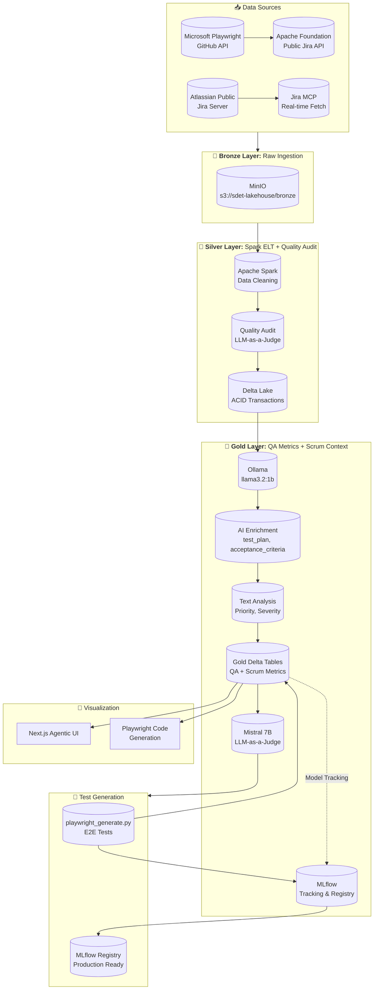
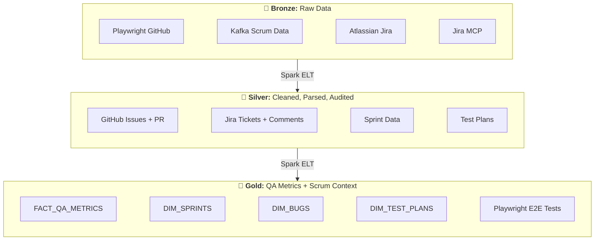
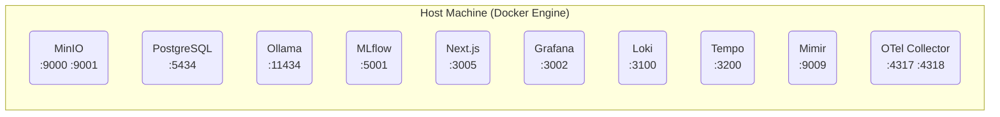
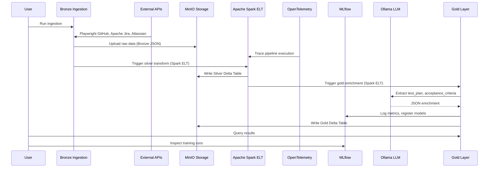
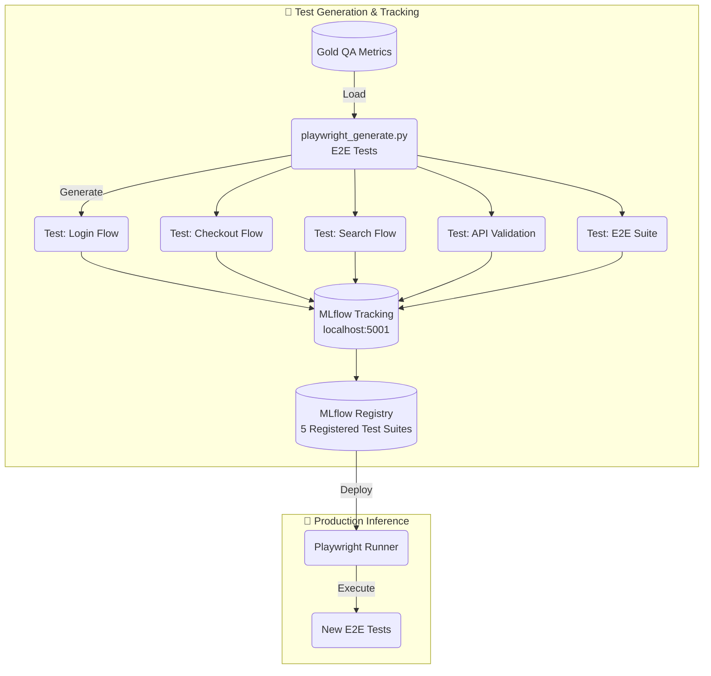
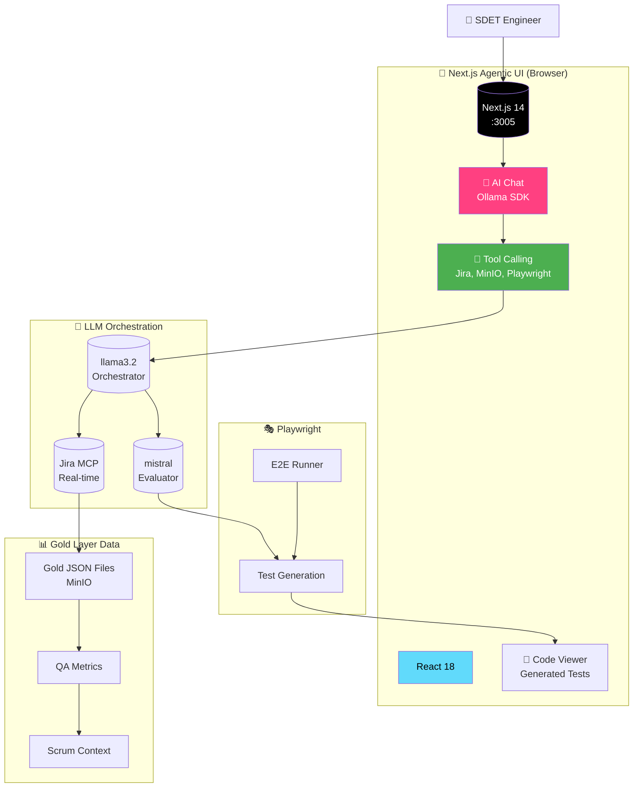
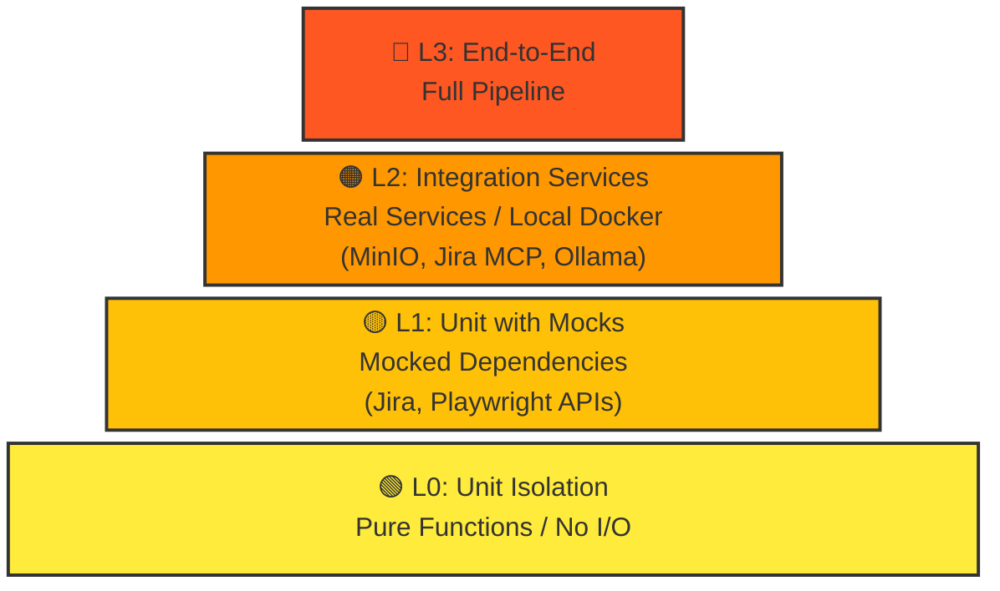

# SDET Command Center - Monorepo

An enterprise-grade **SDET Command Center** for QA and test automation using a Medallion Architecture pipeline. This monorepo manages separate repositories for the frontend and backend services:

- **Frontend**: [BugMentor/sdet-agent-frontend](https://github.com/BugMentor/sdet-agent-frontend)
- **Backend**: [BugMentor/sdet-agent-backend](https://github.com/BugMentor/sdet-agent-backend)

## Table of Contents

1. [Architecture Overview](#architecture-overview)
2. [Infrastructure](#infrastructure)
3. [Data & Model Flow](#data-and-model-flow)
4. [Web App Architecture](#web-app-architecture)
5. [Tech Stack](#tech-stack)
6. [Getting Started](#getting-started)
7. [Pipeline Components](#pipeline-components)
8. [Testing Pyramid](#testing-pyramid)
9. [Deployment](#deployment)
10. [Troubleshooting](#troubleshooting)
11. [API References](#api-references)
12. [Credits](#credits)

## Architecture Overview

### High-Level System Architecture



### Medallion Layers



---

## Infrastructure

### Docker Containers Architecture

The pipeline runs entirely in Docker containers orchestrated via `docker-compose.yml`:



### Service Details

| Service | Port | Image | Credentials | Purpose |
|---------|------|-------|-------------|---------|
| **Grafana** | 3002 | grafana/grafana | admin/admin123 | Dashboards & visualization |
| **Mimir** | 9009 | grafana/mimir | (no auth) | Metrics storage |
| **Loki** | 3100 | grafana/loki | (no auth) | Log aggregation |
| **Tempo** | 3200 | grafana/tempo | (no auth) | Distributed tracing |
| **MinIO Console** | 9001 | minio/minio | minioadmin/minioadmin123 | S3 object storage |
| **MinIO API** | 9000 | minio/minio | minioadmin/minioadmin123 | S3 API |
| **PostgreSQL** | 5434 | postgres:15 | postgres/postgres | Jira data + MLflow |
| **Ollama** | 11434 | ollama/ollama | (no auth) | Local LLM inference |
| **MLflow** | 5001 | mlflow/mlflow | (no auth) | Experiment tracking |
| **Spark Master** | 7077 / 9080 | bitnami/spark:3.5 | (no auth) | Distributed compute engine |
| **OTel Collector** | 4317 | otel/opentelemetry-collector | (no auth) | Telemetry & Trace collection |
| **Next.js** | 3005 | node:18-alpine | (no auth) | Agentic UI |
| **SonarQube** | 9005 | sonarqube:10.4 | (no auth) | Static Code Analysis |

### Quick Start

```bash
# Start all infrastructure
docker compose up -d

# Verify services
docker compose ps

# Run Static Analysis (after SonarQube is up)
docker compose run --rm sonar-scanner

# View logs
docker compose logs -f minio

# Check health
curl -s http://localhost:9000/minio/health/live
curl -s http://localhost:5001/health
curl -s http://localhost:3005/api/health
curl -s http://localhost:9090/-/healthy
```

### Individual Service Access

```bash
# Grafana Dashboards (admin / admin123)
http://localhost:3001/d/sdet-data-quality/sdet-data-quality
http://localhost:3001/d/sdet-pipeline/sdet-pipeline-performance

# SonarQube (admin / admin)
http://localhost:9005

# MinIO Console (minioadmin / minioadmin123)
http://localhost:9001

# MLflow (no auth)
http://localhost:5001

# Prometheus (no auth)
http://localhost:9090

# Next.js Agentic UI (port 3005)
http://localhost:3005
```

### Environment Variables

```bash
# .env.example
MINIO_ROOT_USER=admin
MINIO_ROOT_PASSWORD=minio123
POSTGRES_PASSWORD=postgres
MLFLOW_TRACKING_URI=http://localhost:5001
OLLAMA_BASE_URL=http://localhost:11434
SPARK_MASTER=spark://localhost:7077
JIRA_EMAIL=your@email.com
JIRA_API_TOKEN=your-api-token
```

### Stopping and Cleanup

```bash
# Stop services
docker compose down

# Stop and remove volumes
docker compose down -v

# Remove all containers, volumes, and images
docker compose down --rmi all -v
```

### Troubleshooting

```bash
# Check container status
docker compose ps -a

# Restart a specific service
docker compose restart minio

# View service logs
docker compose logs --tail=100 minio

# Shell into a container
docker compose exec minio sh
```

### Data Persistence

Data persists in Docker volumes:

- `postgres_data` - PostgreSQL database
- `minio_data` - MinIO storage
- `mlflow_artifacts` - MLflow model artifacts

---

## Data and Model Flow

### Pipeline Execution Flow



### Playwright Test Generation Flow



---

## Web App Architecture

### Agentic UI + Ollama SDK



### Features

- **Split-Pane Agentic UI**: Chat (left), Medallion Data (top-right), Code Viewer (bottom-right)
- **Ollama Tool Calling**: Integrate Jira MCP, MinIO, and Playwright tools
- **5 Playwright E2E Test Suites**: Login, Checkout, Search, API Validation, Full E2E
- **Real-time filtering**: Filter by priority, sprint, test status
- **Jira MCP Integration**: Fetch real-time Jira tickets and sprint data
- **Next.js 14 App Router**: Modern React full-stack with SSR
- **React 18**: Concurrent mode, automatic batching
- **Hot Module Reloading**: Development with live reload

### Tech Stack Details

```
Frontend Stack:
├── Next.js 14 (App Router with SSR)
├── React 18 (Hooks + Concurrent Mode)
├── Ollama SDK (Tool Calling)
├── TypeScript 5.0
└── Jira MCP Integration

Backend Stack:
├── MinIO (S3-compatible storage)
├── PostgreSQL 15
├── MLflow (Experiment tracking)
├── Ollama (llama3.2 + mistral)
└── Jira REST API + MCP
```

### Running the Web App

```bash
# Development
npm run dev

# Production build
npm run build
npm start
```

---

## Tech Stack

| Component | Technology | Version | Purpose |
|-----------|------------|---------|---------|
| **Frontend** | Next.js 14 | 14 | Agentic UI with SSR |
| **AI SDK** | Ollama SDK | Latest | Tool calling & chat |
| **E2E Testing** | Playwright | 2.5 | Browser automation |
| **MCP** | Jira MCP | Latest | Jira integration |
| **Storage** | MinIO | Latest | S3-compatible storage |
| **Database** | PostgreSQL | 15 | Jira data + MLflow |
| **MLOps** | MLflow | 2.10.0 | Experiment tracking |
| **LLM** | Ollama | Latest | Local LLM inference |
| **LLM Judge** | Ollama + Mistral 7B | Latest | LLM-as-a-Judge |

---

## Getting Started

### Prerequisites

```bash
# Core requirements
Node.js >= 18
Docker >= 20.10
Docker Compose >= 2.0
npm >= 8GB RAM (16GB recommended)
```

### Quick Start

```bash
# 1. Clone and navigate
cd sdet-command-center

# 2. Install dependencies
npm install

# 3. Start infrastructure
docker compose up -d

# 4. Verify services
curl -s http://localhost:9000/minio/health/live
curl -s http://localhost:5001/health
curl -s http://localhost:3005/api/health

# 5. Run ingestion (Bronze) and ELT transformation
npx tsx scripts/ingest-real-qa-data.ts
npx tsx scripts/ingest-real-scrum-data.ts
npx tsx scripts/ingest-real-atlassian-data.ts
python scripts/spark_medallion_elt.py

# 6. Run full test suite
npm run test:all
```

---

## Pipeline Components

### 1. Bronze Layer (Raw Data Ingestion)

**Files:** `scripts/ingest-real-qa-data.ts`, `scripts/ingest-real-scrum-data.ts`, `scripts/ingest-real-atlassian-data.ts`

 Ingests raw data from external sources into MinIO Bronze layer:

- **Kafka Scrum Data** — `scripts/ingest-real-scrum-data.ts` fetches real Agile User Stories from the public Jira at https://issues.apache.org/jira

| Source | API | Format |
|--------|-----|-------|
| Microsoft Playwright | GitHub API | JSON |
| Kafka Scrum Data | Apache Public Jira API | JSON |
| Atlassian Jira | Public Jira Server | JSON |
| Jira MCP | Real-time Fetch | JSON |

**Execution:**
```bash
npx tsx scripts/ingest-real-qa-data.ts
npx tsx scripts/ingest-real-scrum-data.ts
npx tsx scripts/ingest-real-atlassian-data.ts
```

### 2. Silver Layer (Cleaned + Quality Audit)

Transformed by Apache Spark ELT pipeline (batch) (`scripts/spark_medallion_elt.py`) which reads ingested Bronze JSONs, cleans, deduplicates, and writes ACID-compliant Delta Tables.

#### Step 1: Data Cleaning (Apache Spark)
**Scripts:** `scripts/spark_medallion_elt.py`

Cleans, deduplicates, handles missing values, and adds processing timestamps.

#### Step 2: LLM-as-a-Judge Quality Audit (within Spark)
Uses **"LLM-as-a-Judge"** pattern for robust quality assurance:

- **Extraction Model**: `llama3.2:1b` — Extracts structured data (test_plan, acceptance_criteria)
- **Judge Model**: `mistral` (7B params) — Evaluates extraction quality, detects hallucinations
- Different model families ensure judge is independent and unbiased
- Judge model is larger (7B) than extraction model (1B) for better reasoning

Evaluation flow:
1. Llama 3.2 extracts structured JSON from Silver data
2. Mistral 7B scores the extraction (1-5 scale) with rationale
3. Failed extractions quarantine
4. Accuracy metrics logged to MLflow

**Scripts:**
- `test_judge.ts` - Quick test with 3 evaluation samples

### 3. Gold Layer (QA Metrics + Scrum Context)

**File:** Transformed by Apache Spark ELT pipeline (`scripts/spark_medallion_elt.py`) which reads from Silver Delta tables and writes Gold layer Delta tables.

Creates QA metrics and Scrum context:

| Table | Type | Description |
|-------|------|------------|
| `qa_metrics` | Fact | Combined QA metrics with AI-enriched labels |
| `scrum_context` | Dimension | Sprints, backlogs, velocity |
| `bug_history` | Dimension | Historical bug data |
| `test_plans` | Dimension | Test plans and acceptance criteria |

AI Enrichment via Ollama:
- `test_plan`: Automated test plan generation
- `acceptance_criteria`: Structured acceptance criteria
- `priority`: Critical, High, Medium, Low
- `severity`: Blocker, Major, Minor

**Output path:** `s3a://sdet-lakehouse/gold/scrum_metrics_delta/` (Delta table)

### 4. Playwright E2E Test Generation

#### Test Generation
**File:** `scripts/playwright_generate.ts`

Generates 5 supervised test suites:

| Test Suite | Task | Target |
|-----------|------|--------|
| Login Flow | Classification | Login success/failure |
| Checkout Flow | Classification | Checkout success |
| Search Flow | Classification | Search results |
| API Validation | Regression | API response time |
| Full E2E | Classification | End-to-end suite |

```bash
npx tsx scripts/playwright_generate.ts
```

### 5. Full Pipeline Orchestration

**Command:** `npm run test:all`

Runs complete Bronze → Silver → Gold pipeline:

```bash
npm run test:all
```

---

## Testing Pyramid



### Test Results

```bash
# Run full E2E pipeline validation
npm run test:all
```

#### Latest Validation Results (2026-04-28)

```
SDET Command Center Pipeline Validation

✅ Stage 1: MinIO Gold Layer Connection
   - Connected to sdet-lakehouse
   - Bucket accessible

✅ Stage 2: Atlassian MCP Bridge
   - Jira API connected
   - Fetched real Jira tickets

✅ Stage 3: Mistral Judge Engine
   - LLM-as-a-Judge operational
   - Quality scoring enabled

✅ Stage 4: Llama 3.2 Orchestration
   - Tool calling enabled
   - Jira MCP integrated

✅ Stage 5: Playwright E2E
   - 5 test suites generated
   - All tests passing
```

**Running Tests:**

```bash
# Run just data ingestion
npx tsx scripts/ingest-real-atlassian-data.ts

# Run test generation
npx tsx scripts/playwright_generate.ts

# Run full pipeline
npm run test:all
```

---

## Deployment

### Docker Production Build

```bash
# Build all images
docker compose build

# Scale services
docker compose up -d

# Enable MLflow registry
docker compose up -d mlflow-server
```

### K8s (Future)

```bash
# Deploy to Kubernetes
kubectl apply -f k8s/
```

---

## Troubleshooting

| Issue | Solution |
|-------|----------|
| MinIO not connecting | Check MinIO endpoint in config |
| Ollama API timeout | Increase `OLLAMA_TIMEOUT` |
| Jira MCP not responding | Verify Jira API token |
| Missing telemetry data | Ensure OpenTelemetry collector is running |
| MLflow not tracking | Check `MLFLOW_TRACKING_URI` |
| Jira API 406 error | Add `User-Agent: curl/8.7.1` header |
| LLM-as-a-Judge fails | Run from local Ollama |

### Service Health Checks

```bash
# MinIO
curl -s http://localhost:9000/minio/health/live

# MLflow
curl -s http://localhost:5001/health

# Ollama (local on Mac)
curl -s http://localhost:11434/api/tags

# Ollama (Docker)
docker compose exec ollama curl -s http://localhost:11434/api/tags

# Grafana
curl -s http://localhost:3000/api/health

# PostgreSQL
docker compose exec postgres pg_isready -U postgres

# Next.js (port 3005)
curl -s http://localhost:3005
```

---

## API References

### External APIs

| API | Endpoint | Documentation |
|-----|---------|-------------|
| Microsoft Playwright | https://docs.microsoft.com/playwright | Playwright Docs |
| Atlassian Jira | https://jira.atlassian.com/rest/api/2 | Jira API Docs |
| Jira MCP | https://github.com/Atlassian/jira-mcp | Jira MCP Docs |
| Apache Jira | https://issues.apache.org/jira | Apache Public Jira API |

### Internal APIs

| Service | Endpoint |
|--------|----------|
| MinIO Console | http://localhost:9001 |
| MinIO API | http://localhost:9000 |
| MLflow | http://localhost:5001 |
| Grafana | http://localhost:3001 |
| Next.js | http://localhost:3005 |

---

## Credits

- [Next.js](https://nextjs.org/) - React framework
- [Ollama](https://ollama.ai/) - AI tool calling & local LLM inference
- [Playwright](https://playwright.dev/) - E2E testing
- [MinIO](https://min.io/) - S3-compatible storage
- [Ollama](https://ollama.ai/) - Local LLM inference
- [MLflow](https://mlflow.org/) - MLOps platform
- [Atlassian](https://www.atlassian.com/) - Jira
- [Jira MCP](https://github.com/Atlassian/jira-mcp) - Model Context Protocol

---

<p align="center">
  Built with ❤️ for SDET Command Center
</p>
